# CodeChef Contest Control Center

A modern **Contest Control Center** built using **Next.js**, **React**, **TypeScript**, and **Tailwind CSS**.

This project simulates an administrative dashboard used to monitor and manage competitive programming contests. It provides participant management, live submission monitoring, contest analytics, dynamic leaderboard management, and recent contest activities through a responsive and interactive interface.

---
## Project Overview

The CodeChef Contest Control Center is a frontend web application that simulates an administrative dashboard for managing programming contests. It provides tools to monitor participants, submissions, leaderboards, contest analytics, and recent activities through a clean and responsive user interface built using modern React development practices.

---

## Repository

GitHub Repository:

https://github.com/athikamh/codechef-contest-control-center

---

## Live Demo

https://codechef-contest-control-center-cd0pcl7hw-athika.vercel.app


---

# Tech Stack

- Next.js 16
- React 19
- TypeScript
- Tailwind CSS
- React Context API
- Recharts
- Lucide React Icons
- shadcn/ui

---

# Project Setup

## Clone the repository

```bash
git clone https://github.com/athikamh/codechef-contest-control-center.git
cd codechef-contest-control-center
```

## Install dependencies

```bash
npm install
```

## Start development server

```bash
npm run dev
```

Visit

```
http://localhost:3000
```

---

## Build Production

```bash
npm run build
```

---

## Run ESLint

```bash
npm run lint
```

---

# Project Structure

```
src
│
├── app
│   ├── activity
│   ├── leaderboard
│   ├── participants
│   ├── submissions
│   ├── layout.tsx
│   └── page.tsx
│
├── components
│   ├── activity
│   ├── charts
│   ├── dashboard
│   ├── leaderboard
│   ├── layout
│   ├── participants
│   ├── submissions
│   └── ui
│
├── context
│   └── ContestContext.tsx
│
├── data
│   └── contestData.ts
│
├── hooks
├── lib
├── store
├── types
└── utils
```

---

# Features

## Dashboard

- Contest overview
- Statistics cards
- Submission trend chart
- Language distribution chart
- Contest status panel
- Top performers
- Recent contest activity

---

## Participants

- Participant list
- Search participants
- Online/Offline status badges
- Shared state using Context API

---

## Submissions

- Live submissions table
- Search functionality
- Verdict filter
- Programming language filter

---

## Leaderboard

- Live contest rankings
- Freeze leaderboard
- Unfreeze leaderboard
- Rejudge participant
- Automatic leaderboard recalculation
- Medal indicators for top performers

---

## Activity

- Recent contest events
- Verdict badges
- Relative timestamps

---

# State Management

The application uses **React Context API** for centralized state management.

The Contest Context stores:

- Participants
- Leaderboard
- Frozen leaderboard snapshot
- Freeze status

The following actions are exposed throughout the application:

- Freeze / Unfreeze Leaderboard
- Rejudge Participant
- Reset Contest

Using Context API allows every page to stay synchronized without prop drilling.

---

# Dynamic Functionality

### Freeze Leaderboard

- Stores the current leaderboard snapshot.
- Prevents ranking updates while frozen.
- Unfreezing restores live rankings.

### Rejudge

- Simulates contest re-evaluation.
- Updates participant score, solved count and penalty.
- Automatically recalculates rankings.

### Search & Filters

- Participant search
- Submission search
- Verdict filtering
- Language filtering

---

# Data Flow

```
contestData.ts
        │
        ▼
ContestContext
        │
        ▼
ContestProvider
        │
 ┌──────┼─────────────┐
 ▼      ▼             ▼
Dashboard
Participants
Leaderboard
Submissions
Activity
```

Whenever a participant is rejudged, the Context updates the participant information and recalculates the leaderboard automatically.

When the leaderboard is frozen, a snapshot of the rankings is preserved until it is manually unfrozen.

---

# Assumptions

- Contest data is locally mocked.
- No backend/database is used.
- Authentication is not implemented.
- Charts use sample contest statistics.
- Rejudge simulates score recalculation.
- Freeze Leaderboard preserves rankings until manually released.
- The application functions entirely using local mock data without backend integration.

---

# Screenshots

## Dashboard Overview

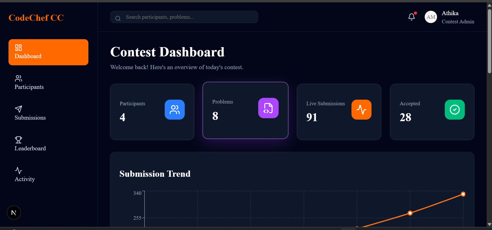

---

## Submission Trend Chart

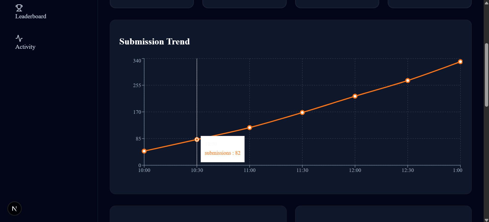

---

## Contest Analytics

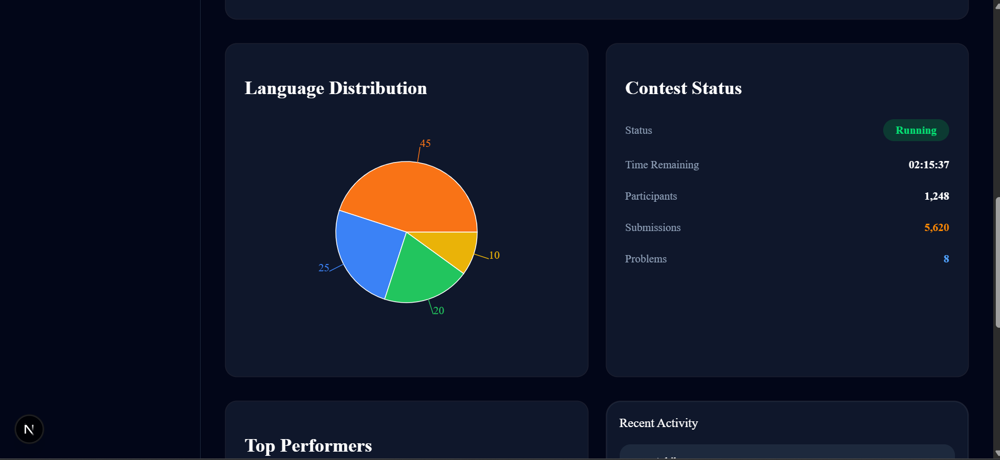

---

## Top Performers

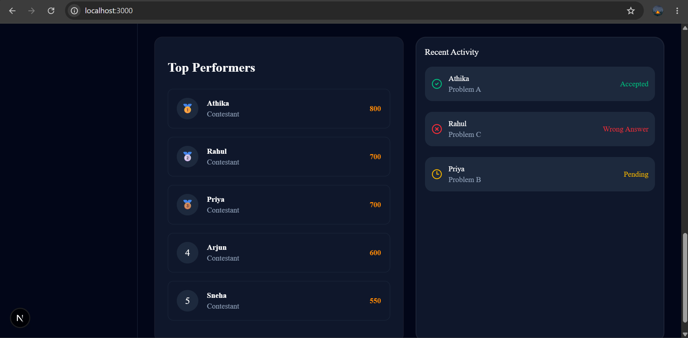

---

## Participants Page

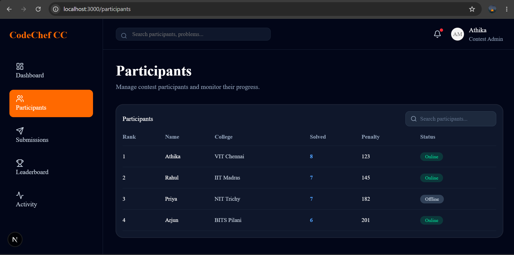

---

## Submissions - Filters

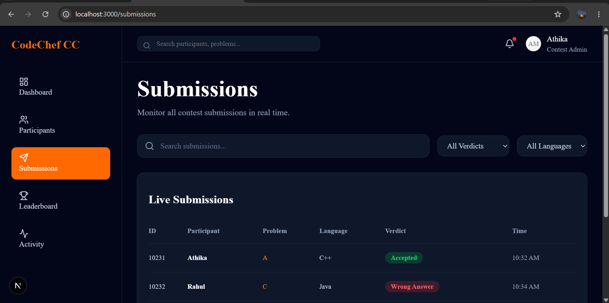

---

## Live Submissions Table

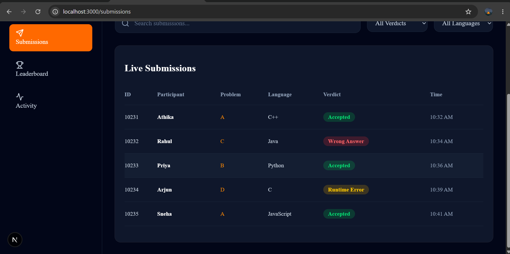

---

## Leaderboard Overview

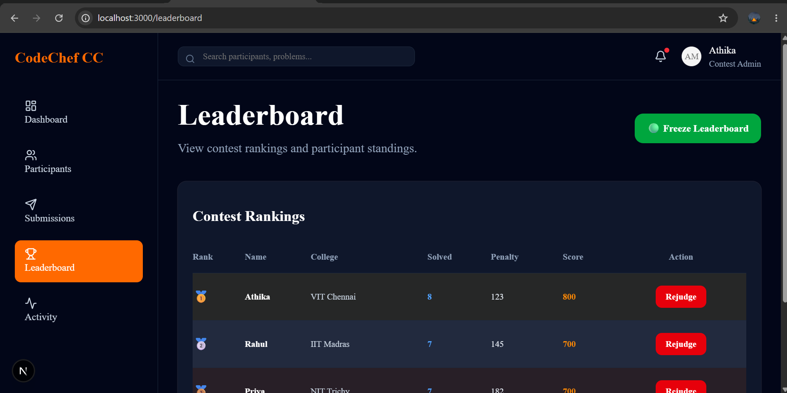

---

## Leaderboard Rankings

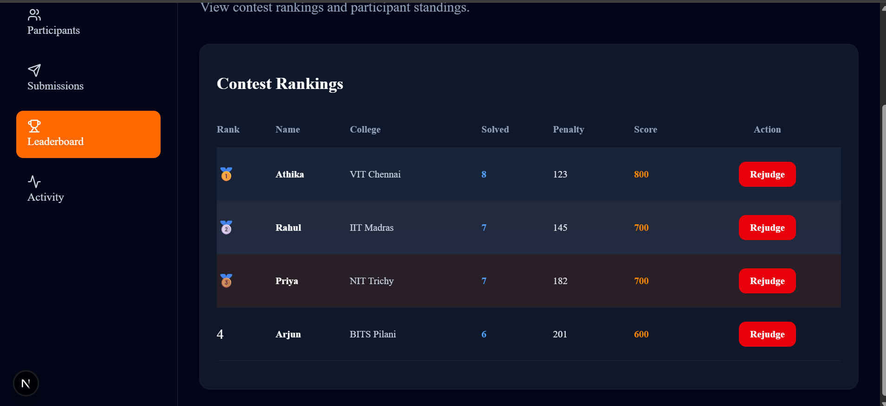

---

## Activity Page

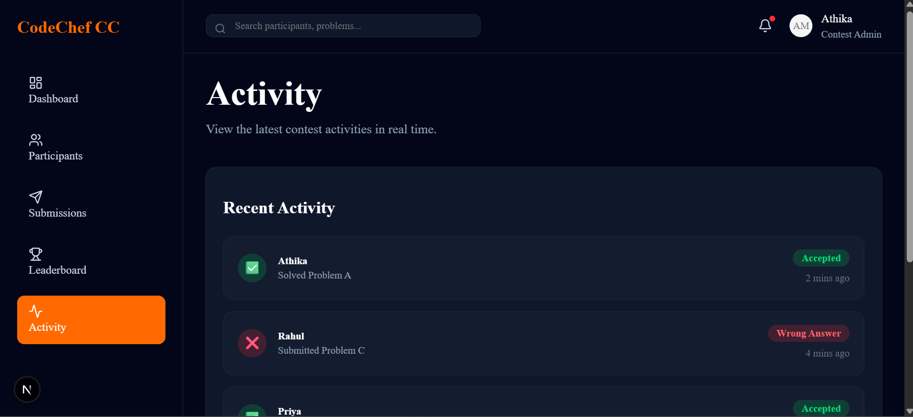

---

## Recent Activity

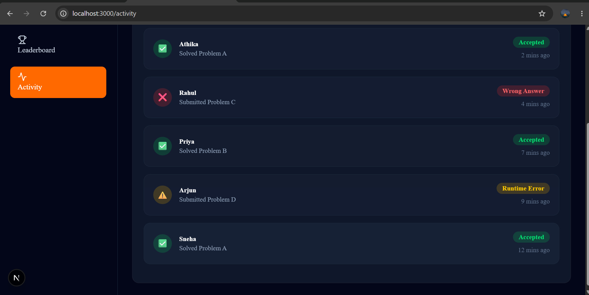

---

# Future Improvements

- Backend integration
- Database support
- Authentication
- WebSocket-based live updates
- Contest CRUD operations
- Role-based access control
- Leaderboard export
- Pagination
- Mobile optimization
- Dark/Light theme toggle

---

# Build Verification

The project successfully passes:

✅ Production Build

```bash
npm run build
```

✅ ESLint

```bash
npm run lint
```

---

# Deployment

Live Application

https://codechef-contest-control-center-cd0pcl7hw-athika.vercel.app


---

# Author

**Athika MH**

Built as part of the **CodeChef Frontend Assignment** using Next.js, React, TypeScript and Tailwind CSS.